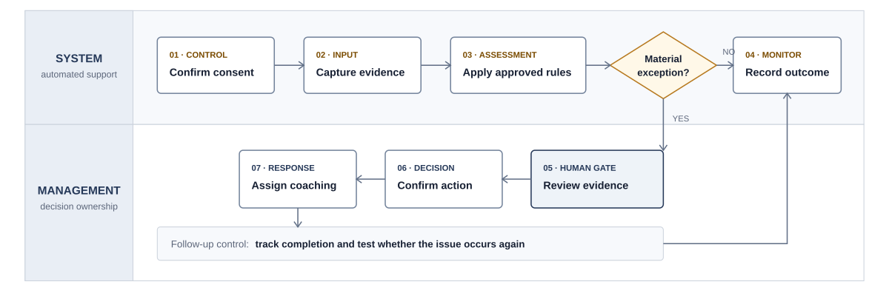

# AI Control Layer for Field Operations

## Executive summary

Designed a control and measurement framework for a field-service workflow. The concept converts technician activities into observable events, validates required steps, highlights exceptions, and routes evidence to managers for review. The proposed dashboard helps leadership see where a process is failing, which technician or service type needs support, and whether coaching resolves recurring issues.

## Business problem

Written procedures alone do not show whether work was completed correctly. Management needed a practical way to connect field activity, training, compliance, and performance reporting inside future software.

## My approach

1. Reviewed process documents and stakeholder discussions.
2. Broke the technician journey into distinct events and decision points.
3. Identified mandatory gates, evidence requirements, and exception paths.
4. Defined measurable events and calculation-ready KPIs.
5. Connected each control to dashboard views and management actions.
6. Mapped a future AI-assisted review loop with human oversight.

## Example control framework

| Workflow stage | Control point | Evidence | Example metric | Management action |
|---|---|---|---|---|
| Pre-job | Required training is current | Training record | Training completion rate | Assign missing module |
| Arrival | Arrival and job start captured | Timestamp/location event | On-time arrival rate | Review scheduling issue |
| Assessment | Mandatory checklist completed | Form fields/photos | First-pass checklist completion | Return task for completion |
| Customer interaction | Approved interaction captured | Consent + authorized record | Reviewable interaction rate | Investigate missing evidence |
| Work completion | Required evidence attached | Photos, readings, signature | Documentation completeness | Block closeout until complete |
| Follow-up | Issue and coaching outcome tracked | Review/coaching record | Repeat-issue rate | Escalate recurring pattern |

## KPI categories

- **Compliance:** required-step completion, evidence completeness, training currency
- **Quality:** first-pass quality, rework rate, repeat issue rate
- **Productivity:** cycle time, jobs completed, stage delays
- **Customer:** commitment adherence, escalation rate, satisfaction signals
- **Coaching:** coaching assigned, completion time, post-coaching improvement

## AI-assisted process concept

The system confirms consent, captures approved information, applies a management-approved rubric, displays supporting evidence and confidence, sends material findings for human review, assigns coaching, and monitors whether the issue occurs again.

## Deliverables

- Current/future workflow map
- Control-point matrix
- KPI and metric dictionary
- Dashboard wireframe requirements
- AI governance and human-review concept

## Skills demonstrated

Process mapping · Requirements analysis · KPI design · Operational controls · Dashboard planning · Responsible AI workflow design
