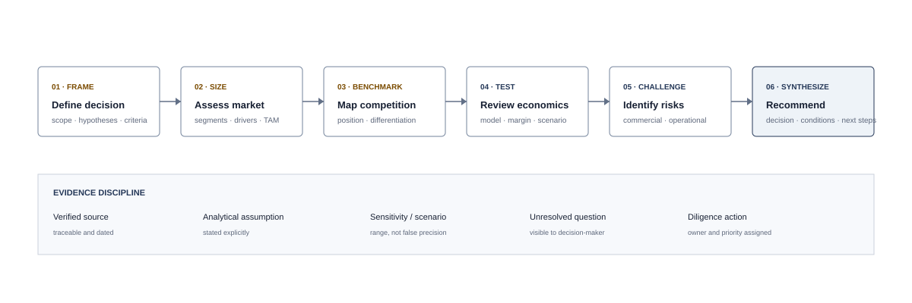
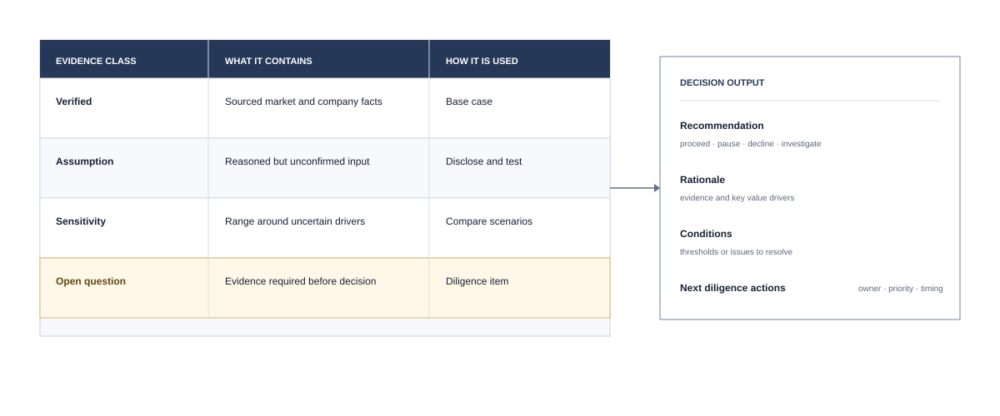

# Market & Investment Research

## Executive summary

Conducted market, strategic, and financial research to support investment and business decisions. My work brings together fragmented quantitative and qualitative evidence and converts it into a clear view of market attractiveness, competitive position, risks, and next steps.

## Typical analytical structure

1. Define the decision, scope, and key hypotheses.
2. Assess market size, growth drivers, and customer segments.
3. Map competitors and sources of differentiation.
4. Review the business model, unit economics, and financial performance.
5. Identify commercial, operational, and execution risks.
6. Synthesize evidence into recommendations and diligence questions.

## Representative outputs

- TAM/SAM/SOM and market landscape analysis
- Competitor benchmarking and positioning maps
- Financial models and scenario analysis
- Business-plan review and recommendation decks
- M&A research and acquisition screening support
- Portfolio monitoring and performance summaries

## Research principle

Every recommendation should distinguish verified evidence, analytical assumptions, and unresolved questions so decision-makers can see both the conclusion and its level of confidence.

## Skills demonstrated

Market research · Competitive intelligence · Financial analysis · Investment research · Scenario analysis · Executive synthesis
